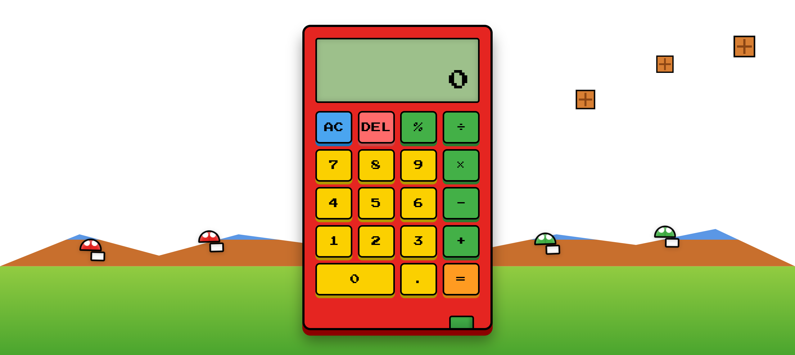

# 马里奥风格计算器 (Mario Style Calculator)

一个独特的网页计算器，完美融合经典超级马里奥游戏元素与实用计算功能，带来趣味十足的计算体验。



## ✨ 特性

### 🎮 游戏风格界面
- 经典马里奥视觉元素：
  - 动态浮动的云朵背景
  - 像素风格的砖块装饰
  - 经典的超级蘑菇和1UP蘑菇
  - 标志性的绿色管道
  - 远景山丘剪影
- 马里奥角色动画效果
- 原版游戏音效

### 🧮 计算功能
- 基础运算：
  - 加减乘除运算
  - 百分比计算
  - 支持负数计算
  - 精确的小数运算
- 智能错误处理：
  - 除以零保护
  - 溢出检测
  - 友好的错误提示
- 数字格式化：
  - 自动千位分隔
  - 科学计数法支持
  - 最高10位小数精度

### 🎨 视觉特效
- 动态元素：
  - 云朵飘动效果
  - 蘑菇浮动动画
  - 按键反馈动画
  - 结果显示过渡
- 像素风格设计：
  - 复古游戏字体
  - 像素化装饰元素
  - 经典配色方案

### 🎵 音效系统
- 原版马里奥音效：
  - 金币音效（按键反馈）
  - 跳跃音效（运算符）
  - 管道音效（清除/计算）

### 📱 响应式设计
- 全设备适配：
  - 移动端优化布局
  - 触摸操作优化
  - 横屏模式支持
- 性能优化：
  - 流畅动画效果
  - 优化的触摸响应
  - 硬件加速支持

## 🚀 在线体验

你可以通过以下链接体验这个项目：

- Cloudflare Pages: [你的域名].pages.dev
- GitHub Pages链接缺少用户名

## 🛠️ 技术实现

### 核心技术
- HTML5：语义化结构
- CSS3：
  - Flexbox/Grid 布局
  - CSS 动画和过渡
  - 媒体查询响应式设计
  - 变量与渐变
- JavaScript：
  - ES6+ 特性
  - 面向对象编程
  - 事件处理优化
  - 音频控制

### 视觉效果实现
- 背景层次：
  - 渐变天空背景
  - 远景山丘剪影
  - 动态云朵系统
  - 装饰性元素
- 动画系统：
  - CSS Keyframe 动画
  - JavaScript 动态效果
  - 硬件加速优化
  - 性能优化处理

### 响应式设计
- 移动优先原则
- 弹性布局系统
- 触摸操作优化
- 设备特定适配

## 💻 本地运行

### 环境要求
- 现代浏览器（支持ES6+）
- 本地服务器（任选其一）：
  - Python 3
  - Node.js
  - VS Code Live Server

### 安装步骤
1. 克隆项目：
```bash
git clone https://github.com/[你的用户名]/mario-calculator.git
```

2. 进入目录：
```bash
cd mario-calculator
```

3. 启动服务器：
   - Python 方式：
     ```bash
     python -m http.server 8000
     ```
   - Node.js 方式：
     ```bash
     npx http-server
     ```
   - VS Code：
     - 安装 "Live Server" 插件
     - 右键 index.html，选择 "Open with Live Server"

4. 访问项目：
   - Python: http://localhost:8000
   - Node.js: http://localhost:8080
   - VS Code: http://localhost:5500

## 🚀 部署指南

### Cloudflare Pages 部署

1. 在 GitHub 上创建仓库并推送代码
2. 登录 [Cloudflare Dashboard](https://dash.cloudflare.com/)
3. 进入 Pages 页面
4. 点击 "创建项目"
5. 选择 "连接到 Git"
6. 选择你的 GitHub 仓库
7. 部署设置：
   - 构建设置：无需配置（静态网站）
   - 环境变量：无需配置
8. 点击 "保存并部署"

### GitHub Pages 部署

1. 在 GitHub 上创建仓库
2. 将代码推送到仓库：
```bash
git init
git add .
git commit -m "Initial commit"
git branch -M main
git remote add origin https://github.com/[你的用户名]/mario-calculator.git
git push -u origin main
```

3. 在仓库设置中启用 GitHub Pages：
   - 进入仓库的 Settings
   - 找到 Pages 设置
   - Source 选择 main 分支
   - 保存设置

## 🎮 使用指南

### 基本操作
- **数字输入**：
  - 数字键 (0-9)：直接输入数字
  - 小数点 (.)：输入小数
  - 负号 (-)：输入负数
  
- **运算操作**：
  - 基本运算：+, -, ×, ÷
  - 百分比：%
  - 等号 (=)：计算结果
  
- **特殊功能**：
  - AC：清除所有输入（触发马里奥跳跃动画）
  - DEL：删除最后一位
  - 连续运算：支持连续计算

### 快捷键操作
- **数字键**：键盘数字区和主键盘区的数字键
- **运算符**：
  - 加号 (+)：Shift + =
  - 减号 (-)：-
  - 乘号 (×)：*
  - 除号 (÷)：/
- **功能键**：
  - Enter：计算结果
  - Backspace：删除最后一位
  - Delete：清除所有输入
  - Esc：重置计算器

### 使用场景示例
1. **基础计算**：
   ```
   23 + 45 = 68
   128 × 1.5 = 192
   ```

2. **百分比计算**：
   ```
   1000 × 15% = 150（计算15%的值）
   200 + 10% = 220（增加10%）
   ```

3. **连续运算**：
   ```
   5 + 3 × 2 = 11（自动处理优先级）
   ```

### 特色功能
- **动画效果**：
  - 清除时的马里奥跳跃
  - 计算完成的胜利动画
  - 背景元素的持续动画
  
- **音效反馈**：
  - 数字输入：金币音效
  - 运算符：跳跃音效
  - 清除/计算：管道音效

### 高级特性
- **智能计算**：
  - 自动处理运算优先级
  - 精确的小数计算（最高10位小数）
  - 大数字自动格式化（千位分隔）
  
- **错误保护**：
  - 除零保护：显示"Error"提示
  - 溢出检测：数字超过限制时提示
  - 格式错误：输入格式错误时提示

### 常见问题解答（FAQ）
1. **Q: 为什么有时候小数计算结果看起来不太准确？**
   A: 这是由于计算机浮点数计算的特性导致，但我们已经通过四舍五入和精度控制来最小化这个问题。

2. **Q: 计算器支持多大的数字？**
   A: 支持最大16位数字的输入，超过会自动转换为科学计数法显示。

3. **Q: 如何关闭音效？**
   A: 点击界面右上角的音量图标可以切换音效开关。

4. **Q: 为什么移动端操作有延迟？**
   A: 这是为了防止误触设计的，你可以在设置中调整触摸灵敏度。

## 🔄 更新日志

### 最新版本
- 添加经典马里奥背景元素
  - 动态云朵系统
  - 浮动蘑菇装饰
  - 像素风格砖块
- 优化移动端体验
- 改进动画效果
- 增强视觉表现

### 计划功能
- [ ] 主题切换（更多马里奥角色）
- [ ] 计算历史记录
- [ ] 更多游戏音效
- [ ] 键盘快捷键支持
- [ ] 暗色主题支持

## 🤝 贡献指南

### 开发环境设置
1. **基础要求**：
   - Node.js 14.0+
   - Git
   - 现代浏览器（Chrome/Firefox/Safari）
   - 代码编辑器（推荐VS Code）

2. **VS Code 推荐插件**：
   - Live Server
   - ESLint
   - Prettier
   - HTML CSS Support
   - JavaScript (ES6) code snippets

3. **本地开发设置**：
   ```bash
   # 克隆你的Fork仓库
   git clone https://github.com/[你的用户名]/mario-calculator.git
   
   # 进入项目目录
   cd mario-calculator
   
   # 安装开发依赖
   npm install
   
   # 启动开发服务器
   npm start
   ```

### 代码风格指南
1. **HTML规范**：
   - 使用语义化标签
   - 保持结构清晰的缩进
   - 添加必要的ARIA属性
   ```html
   <!-- 推荐写法 -->
   <button class="calculator-btn" aria-label="数字7">
     <span class="btn-text">7</span>
   </button>
   ```

2. **CSS规范**：
   - 使用BEM命名规范
   - 保持选择器简洁
   - 使用CSS变量管理主题
   ```css
   /* 推荐写法 */
   .calculator__button {
     --button-bg: var(--mario-red);
     background-color: var(--button-bg);
   }
   ```

3. **JavaScript规范**：
   - 使用ES6+语法
   - 遵循函数式编程原则
   - 添加必要的注释
   ```javascript
   // 推荐写法
   const calculateResult = (num1, operator, num2) => {
     // 处理数值计算
     return Number.isFinite(result) ? result : 'Error';
   };
   ```

### 提交规范
1. **分支管理**：
   - `main`: 主分支，保持稳定
   - `develop`: 开发分支
   - `feature/*`: 新功能分支
   - `bugfix/*`: 错误修复分支

2. **提交信息格式**：
   ```
   类型(范围): 简短描述

   详细描述（可选）
   ```
   类型包括：
   - feat: 新功能
   - fix: 错误修复
   - docs: 文档更新
   - style: 代码格式
   - refactor: 代码重构
   - test: 测试相关
   - chore: 构建过程或辅助工具的变动

3. **Pull Request流程**：
   1. Fork 项目到个人账号
   2. 创建功能分支：`git checkout -b feature/new-feature`
   3. 提交改动：
      ```bash
      git add .
      git commit -m "feat(calculator): 添加新功能"
      git push origin feature/new-feature
      ```
   4. 在GitHub上创建Pull Request
   5. 等待代码审查和合并

### 测试指南
1. **单元测试**：
   - 使用Jest进行测试
   - 测试文件命名：`*.test.js`
   - 运行测试：`npm test`

2. **UI测试**：
   - 确保响应式布局正常
   - 验证动画效果
   - 测试音效功能

3. **兼容性测试**：
   - 测试主流浏览器
   - 验证移动端适配
   - 检查触摸操作响应

### 项目结构
```
mario-calculator/
├── src/
│   ├── js/
│   │   ├── calculator.js
│   │   ├── animations.js
│   │   └── audio.js
│   ├── css/
│   │   ├── main.css
│   │   └── themes.css
│   └── assets/
│       ├── images/
│       └── sounds/
├── tests/
├── docs/
└── README.md
```

### 注意事项
1. 保持马里奥主题的一致性
2. 确保代码的可维护性
3. 优先考虑用户体验
4. 注重性能优化
5. 编写清晰的文档

## 📝 许可证

[MIT License](LICENSE)

## 🙏 致谢

### 资源来源
- 音效：[The Mushroom Kingdom](https://themushroomkingdom.net/)
- 字体：[Press Start 2P](https://fonts.google.com/specimen/Press+Start+2P)
- 图标：[Super Mario Wiki](https://www.mariowiki.com/)

### 特别感谢
- Nintendo 创造了精彩的马里奥世界
- 开源社区的支持和贡献

## 📞 联系方式

### 问题反馈
- 提交 [Issue](https://github.com/[你的用户名]/mario-calculator/issues)
- 发送邮件：[your-email@example.com]

### 社交媒体
- Twitter: [@YourHandle]
- Discord: [YourServer]